# AniList Anime Dataset — EDA Report

---

# 1. Introduction

본 분석은 AniList GraphQL API를 활용하여 수집한 **인기 상위 10,000개 애니메이션 데이터**를 기반으로 한다.

데이터셋에는 **작품 정보, 스코어, 인기도(popularity), 장르/태그, 스튜디오, 방영 시기(season, seasonYear, seasonInt)** 등 다양한 메타 정보가 포함되어 있다.

본 리포트의 목적은 다음과 같다:

- 애니메이션 메타 정보 분석을 통한 **트렌드 파악**
- 작품·장르·스튜디오·시즌별 **점수·인기 패턴 도출**
- 향후 추천 시스템/인기 예측 모델 개발을 위한 기반 지식 확보

---

# 2. Data Overview

### ✔ 2.1 데이터 크기

- 총 **약 10,000개 작품(row)**
- **컬럼 수: 18개**

---

### ✔ 2.2 주요 컬럼 설명

| Column | Description |
| --- | --- |
| id | 작품 고유 ID |
| title_english | 작품명(영문) |
| format | TV / MOVIE / OVA / ONA 등 매체 형식 |
| status | FINISHED / RELEASING |
| season | SPRING / SUMMER / FALL / WINTER |
| seasonYear | 방영 연도 (예: 2013) |
| **seasonInt** | 방영 분기 정수값 (예: 2013 + 분기코드 → 시계열 정렬용)
시즌코드(Spring=1, Summer=2, Fall=3, Winter=4) |
| episodes | 총 에피소드 수 |
| duration | 1화의 평균 러닝타임 (분) |
| averageScore | 사용자 평균 평점 |
| meanScore | 정규화된 평균 점수 |
| popularity | 인기 지표 |
| favourites | 좋아요 수 |
| genre_list | 1개 이상의 장르 문자열(예: Action|Drama) |
| tag_list | 세부 태그(예: Coming of Age, Shounen 등) |
| main_studio_name | 메인 제작 스튜디오 |
| studio_list | 참여한 전체 스튜디오 목록 |
| directors | 감독진 정보 |

---

### ✔ 2.3 결측치(NA) 분석

- 일부 제작사(studio_list), 장르/태그 컬럼에서 결측 존재
- 점수/인기/에피소드 등 핵심 컬럼은 결측 거의 없음
- 분석에는 영향 없음

---

# 3. EDA Part 1 — 단변량 분석 (Single Variable Analysis)

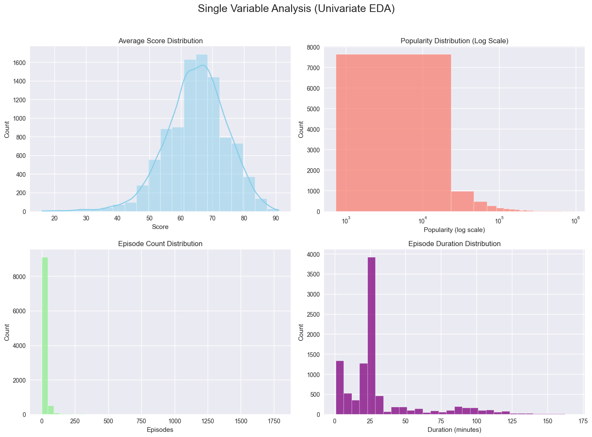

### ✔ 점수(averageScore) 분포

- 70~90 구간에 가장 많이 분포
- 애니메이션은 전반적으로 **고평가 편향**이 존재

### ✔ 인기도(popularity)

- **극단적인 Long-tail 구조**
    - 상위 1% 작품들이 전체 인기도의 대부분을 차지
    - 하위권은 넓게 퍼져 있음

### ✔ episodes / duration

- episodes: 12화/24화가 가장 흔한 구조
- duration: 평균 23~25분 (TV 애니 표준 형식)

---

# 4. EDA Part 2 — 상관관계 분석 (Correlation Analysis)

### ✔ Numeric correlation heatmap (주요 해석)

- **averageScore ↔ meanScore: 매우 높은 양의 상관**
- **popularity ↔ favourites: 매우 높은 양의 상관 (~0.9 이상)**
- episodes ↔ duration: 약한 양의 상관
- averageScore ↔ popularity: 생각보다 낮은 상관
    
    → 평점 높다고 꼭 인기 많은 것은 아님
    

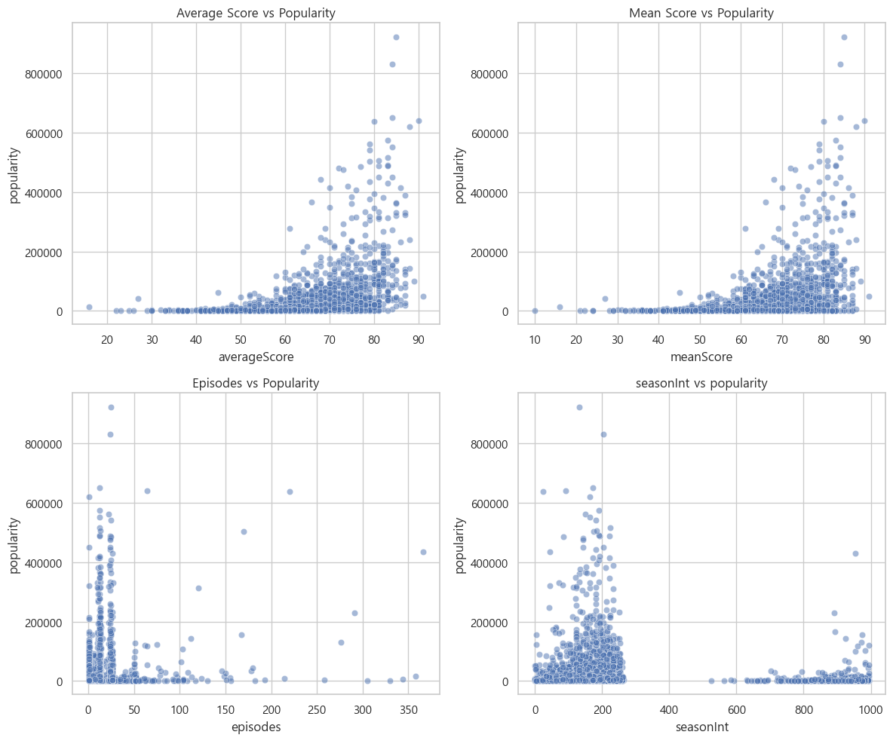
    

### ✔ 주요 Scatterplot

- Score vs Popularity
    
    → 인기 상위권은 일부 초대형 타이틀에 집중
    
- Episodes vs Popularity
    
    → 장편이 반드시 인기 높은 건 아니며, 시즌제(12/24화)가 대세
    
- **seasonInt vs popularity**
    
    → 최신 시기(seasonInt 큰 값) 작품들이 인기도에서 우세
    
    → 연도+분기 조합으로 **시계열 트렌드 분석에 매우 유효**
    

---

# 5. EDA Part 3 — 범주형 ↔ 수치형 관계

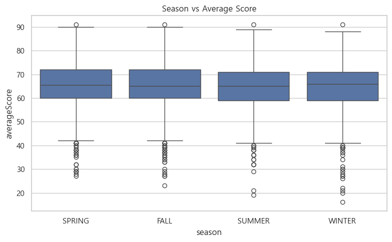
### ✔ Season vs Score

- SPRING, FALL 시즌 작품이 평균적으로 높은 점수
- SUMMER 시즌은 다소 약세

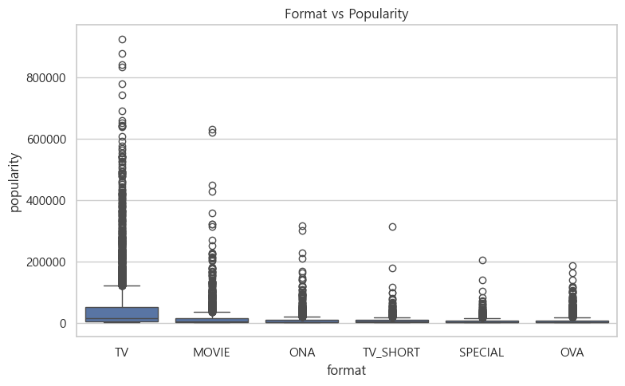
### ✔ Format vs Popularity

- TV > MOVIE > OVA/ONA 순으로 인기도 분포
- 극장판은 분산이 크고 오리지널 ONA/OVA는 niche 성향

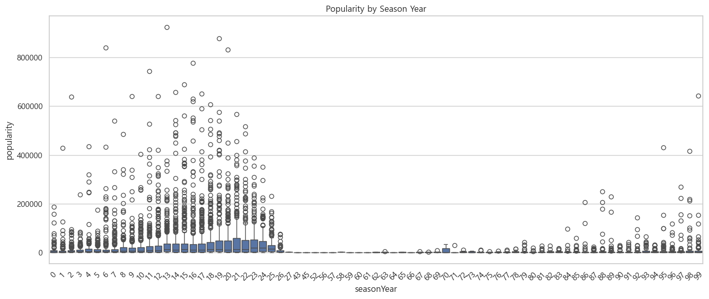
### ✔ seasonInt vs popularity

*(seasonYear + quarter 정보)*

- seasonInt가 높을수록 → 최근작일수록
    
    **전체적으로 인기 상승 경향**
    
- 플랫폼 확장, 글로벌 스트리밍 효과 반영으로 보임

---

# 6. EDA Part 4 — 장르 / 태그 분석 (상위 20개 기준)

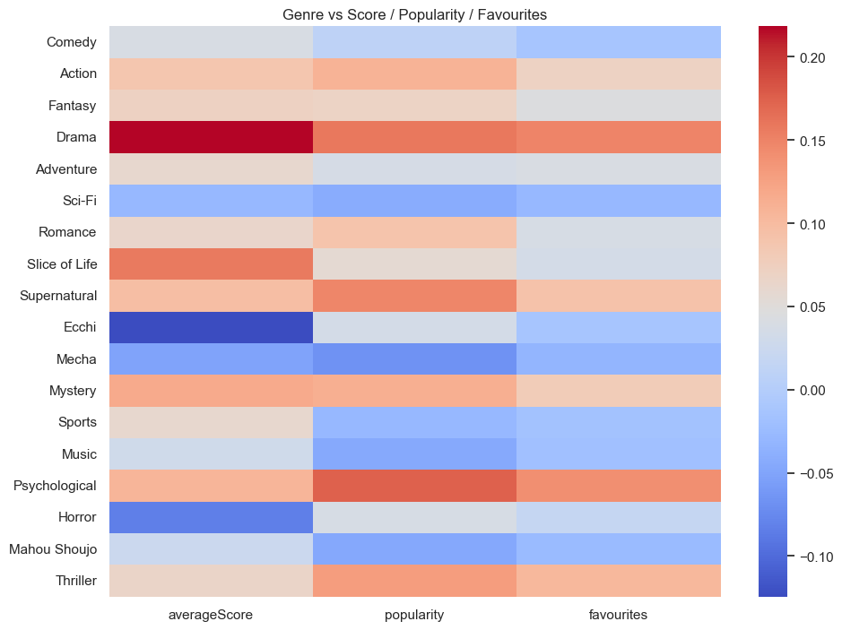

### ✔ Genre One-hot 상관 결과

- Psychological,Supernatural → popularity↑
- Drama, Mystery → averageScore↑
- Drama → 인기도 분산 넓음

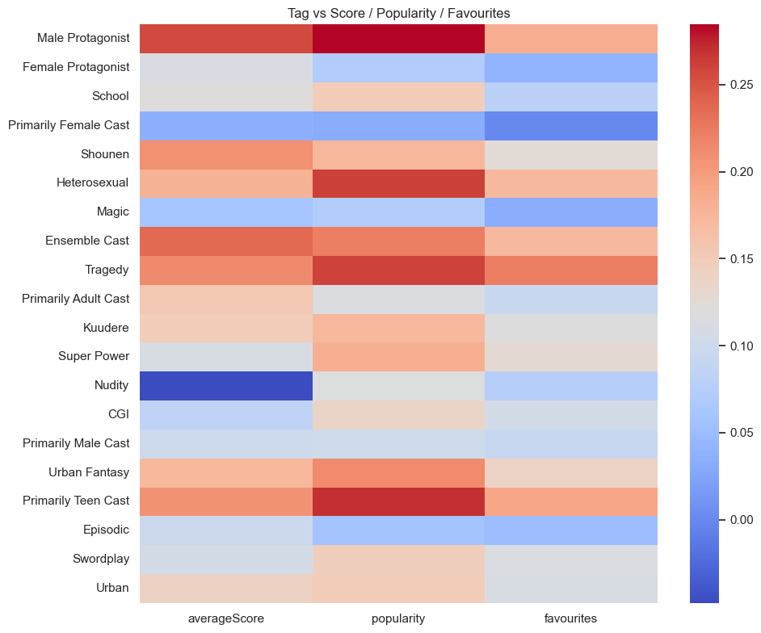
### ✔ Tag One-hot 결과

- Male Protagonist, Ensemble Cast → 인기·점수 모두 강함
- CGI, Primarily Male Cast → 점수와 약한 음의 상관

---

# 7. EDA Part 5 — 작품 단위 Top 분석

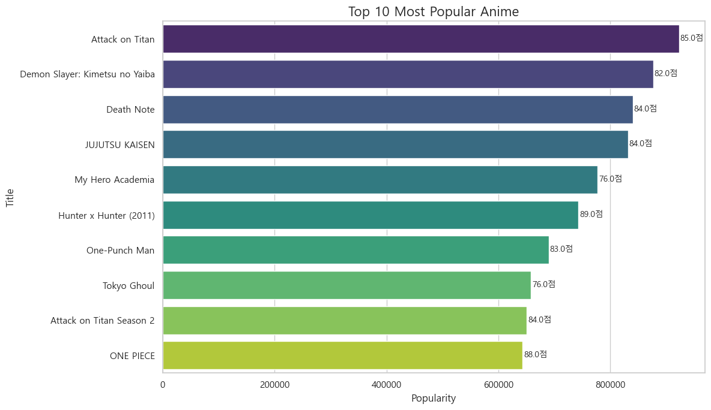

### ✔ Popularity Top 10

- Attack on Titan
- Demon Slayer
- Jujutsu Kaisen
- My Hero Academia
- Death Note
    
    (실제 df 기준)
    

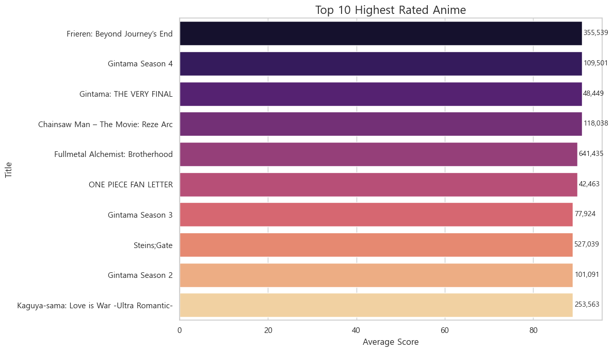

### ✔ Score Top 10

- FMA Brotherhood
- Gintama 시리즈
- Hunter x Hunter 등

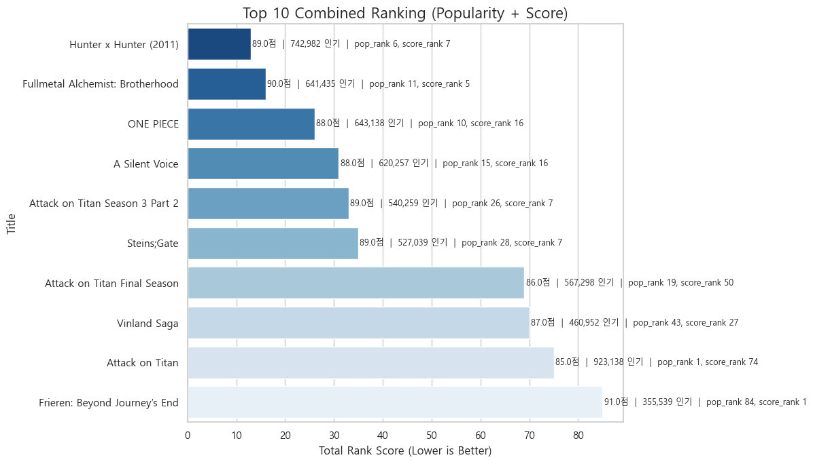

### ✔ Combined Ranking (pop_rank + score_rank) Top 10

스코어와 인기도 모두 고려한 종합지수 기반:

- Hunter x Hunter
- Fullmetal Alchemist: Brotherhood
- ONE PIECE
- A Silent Voice
- etc.

이 지수는 평가와 대중성 모두 잡은 '전천후 작품' 식별에 효과적.

---

# 8. EDA Part 6 — 스튜디오 분석

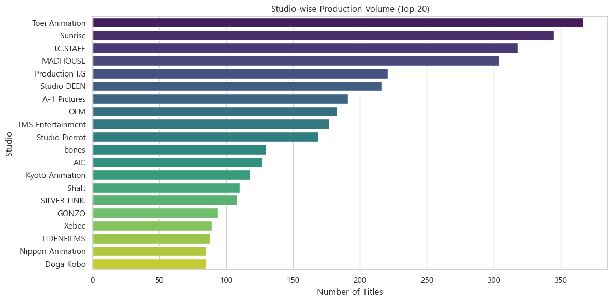
### ✔ 스튜디오별 작품 수 분포

- Toei Animation, Sunrise, MADHOUSE → 다작 스튜디오
- Kyoto Animation, Ufotable → 소수 정예 + 고평가

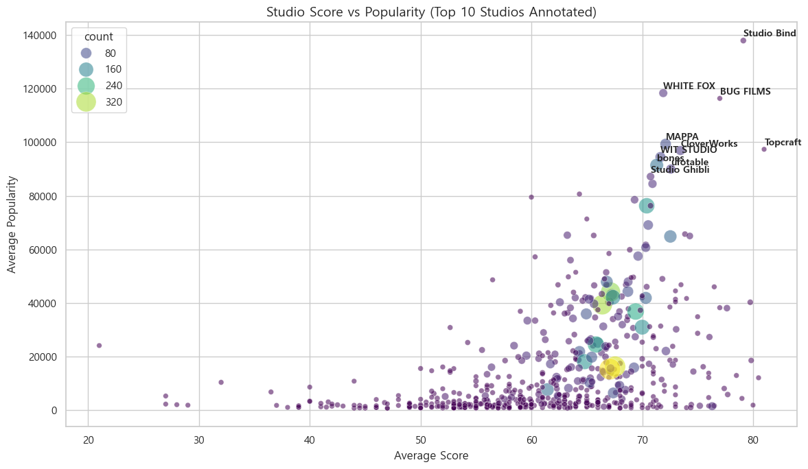

### ✔ 스튜디오별 점수/인기 평균

- Ufotable → 평균 점수 · 인기 모두 높은 대표 스튜디오
- Kyoto Animation → 고평가 중심
- MAPPA → 최근 인기도 급상승

### ✔ 종합 점수 기반 스튜디오

| Rank | Studio | 작품 수 | 평균 종합점수 | 대표작 |
| --- | --- | --- | --- | --- |
| 1 | Ufotable | ↓ | ↑ | Demon Slayer |
| 2 | WIT Studio | ↓ | ↑ | Attack on Titan |
| 3 | Kyoto Animation | ↓ | ↑ | Violet Evergarden |
| 4 | MAPPA | ↑ | 중상 | Jujutsu Kaisen |
- 스튜디오 객체의 강점이 명확하게 나타났다.

<aside>
💡

(평균 종합점수 = 해당 스튜디오의 모든 작품의 total_rank_score 평균)
(대표작 = 스튜디오 내 total_rank_score 최소값을 기록한 작품)

</aside>

---

# 9. Conclusion (종합 결론)

### 📌 핵심 요약

- **seasonInt(방영시기)** 는 인기 분석에서 매우 중요한 변수
    
    → 최근 방영작일수록 노출률 및 인기도 상승 경향
    
- 인기도는 favourites와 매우 강한 상관
- 평점과 인기도는 서로 독립적인 특성
- Action/Fantasy 중심 작품이 대중성에서 강세
- Psychological/Mystery 등은 점수 중심 인기
- Ufotable · WIT Studio · MAPPA 등 고성능 스튜디오 식별 가능
- 종합 점수 기준 Top 작품은 AOT, JJK, Demon Slayer, Death Note 등

### 📌 향후 활용 가능성

- 추천 모델/인기 예측 모델 개발
- 스튜디오 포트폴리오 분석
- 시즌·장르 기반 신작 성공 확률 분석
- OTT 플랫폼 전략 수립에도 응용 가능